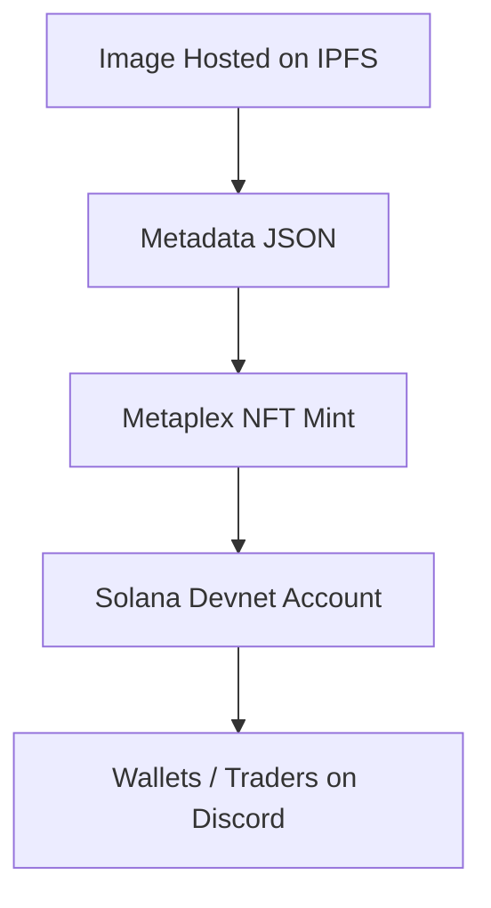

# ⚡ Fuel of Sol — The Energy NFT Revolution on Solana  


> “The spark that powers the Solana galaxy ⚡ — each NFT is a pulse of decentralized energy.”

---

## 🧬 About This NFT Project  

**Fuel of Sol** is a digital art collection powered by the **Solana blockchain**, built to demonstrate the process of **minting, transferring, and trading NFTs** on-chain using the **Metaplex SDK**.  

This project was developed as part of a Solana learning initiative to:  
- Understand the complete NFT creation pipeline (metadata → mint → ownership).  
- Explore peer-to-peer NFT exchange models on **Devnet**.  
- Analyze the **limitations of manual NFT swaps** and propose **trustless trade mechanisms**.  

Each NFT in this collection represents a **unique energy core** that symbolizes power, innovation, and creativity in the Solana ecosystem.  

---

## 🔥 Project Summary  

| Category | Details |
|-----------|----------|
| **Project Name** | Fuel of Sol |
| **Symbol** | FOS |
| **Network** | Solana Devnet |
| **Standard** | Metaplex Token Metadata |
| **Storage** | Pinata (IPFS) |
| **Minted NFT** | `Fuel of Sol #1` |
| **Royalties** | 5% (500 basis points) |
| **Creator Address** | `GFvydGaDq5KG3C5h4SD4giBMqbynaDWNpktLDdxt8aPv` |

---

## 🖼️ NFT Metadata  

- **Metadata JSON (hosted on Pinata):**  
  🔗 [https://bronze-active-cattle-246.mypinata.cloud/ipfs/bafkreickww5lmv3t2yst7uaomjlcy5wq3gr34x6hwnzuvg5icefieexn54](https://bronze-active-cattle-246.mypinata.cloud/ipfs/bafkreickww5lmv3t2yst7uaomjlcy5wq3gr34x6hwnzuvg5icefieexn54)

- **Image:**  
  🖼️ [Fuel of Sol Logo](https://ik.imagekit.io/y8vbhvt7s/New%20Folder/logo%20%20fuel%20solo.png)

- **Description:**  
  > "The spark that powers the Solana galaxy ⚡ — an energy NFT from the Fuel of Sol collection."

---

## ⚙️ Technical Architecture  

The project uses **Solana Devnet** and the **Metaplex JS SDK** for NFT creation and metadata management.  



## ⚙️ Step-by-Step Setup Guide  

Follow these steps to mint your **Fuel of Sol NFT** on Solana Devnet.  

---

### 🧩 1️⃣ Clone the Repository  
```bash
git clone https://github.com/rahulpatle-sol/fuel-of-sol.git
cd fuel-of-sol

npm install
RPC_URL=https://api.devnet.solana.com
SECRET_KEY_PATH=./keypair.json
solana-keygen new --outfile keypair.json
🚀 Minting NFT for project: Fuel of Sol...
✅ NFT Minted Successfully!
🖼️ NFT Address: Ff8hFj9xZ9hMZp6j4DgjP6vh6p83Qj5Gz8bPcvUZUxJb
🔗 View on Solana Explorer: https://explorer.solana.com/address/6SLbMLqnoaSoPzdHJTBQUFu5ewB1PErQjynQa4pTH8tZ?cluster=devnet
```


